<!----------------- BEGIN SLIDE 001 it -------------------------->

#  Progettazione Logica - Dal modello ER a quello Relazionale

<!----------------- COLUMN 1 -------------------------->

> 001

Giuseppe Della Penna

Università degli Studi di L'Aquila    
giuseppe.dellapenna@univaq.it    
http://people.disim.univaq.it/dellapenna

> *Questo documento si basa sulle slide del corso di Laboratorio di Basi di Dati, riorganizzate per una migliore l'esperienza di lettura. Non è un libro di testo completo o un manuale tecnico, e deve essere utilizzato insieme a tutti gli altri materiali didattici del corso. Si prega di segnalare eventuali errori o omissioni all'autore.*

> Quest'opera è rilasciata con licenza CC BY-NC-SA 4.0. Per visualizzare una copia di questa licenza, visitate il sito https://creativecommons.org/licenses/by-nc-sa/4.0

<!----------------- BEGIN TOC -------------------------->

 - [1. Le Fasi di Progettazione di un Database](#1-le-fasi-di-progettazione-di-un-database)

 - [2. Progettazione logica](#2-progettazione-logica)

 - [3. Ristrutturazione dei diagrammi ER](#3-ristrutturazione-dei-diagrammi-er)

    - [3.1. Eliminazione attributi composti e multi valore](#31-eliminazione-attributi-composti-e-multi-valore)

    - [3.2. Identificazione degli attributi derivabili](#32-identificazione-degli-attributi-derivabili)

    - [3.3. Eliminazione delle gerarchie](#33-eliminazione-delle-gerarchie)

    - [3.4. Fusioni e decomposizioni](#34-fusioni-e-decomposizioni)

 - [4. Traduzione nel Modello Relazionale (logico)](#4-traduzione-nel-modello-relazionale-logico)

    - [4.1. Entità e Attributi](#41-entità-e-attributi)

    - [4.2. Relazioni](#42-relazioni)

    - [4.3. Vincoli di Cardinalità](#43-vincoli-di-cardinalità)

    - [4.4. Esempio completo](#44-esempio-completo)

<!------------------- END TOC --------------------------> 

<!------------------- END SLIDE 001 it -------------------------->

<!----------------- BEGIN SLIDE 002 it -------------------------->

## 1. Le Fasi di Progettazione di un Database

<!----------------- COLUMN 1 -------------------------->

> 002

La progettazione di un database passa per tre fasi a cascata:

- Concettuale

- Logica

- Fisica

A monte della progettazione concettuale c'è la raccolta e l'analisi dei requisiti, mentre a valle di quella fisica c'è un DBMS che implementa tutti i requisiti raccolti all'inizio. 

<!------------------- END SLIDE 002 it -------------------------->

<!----------------- BEGIN SLIDE 003 it -------------------------->

## 2. Progettazione logica

<!----------------- COLUMN 1 -------------------------->

> 003

Nella progettazione logica ci si muove dal modello concettuale, del tutto astratto rispetto al database, a un modello logico con le caratteristiche del DBMS in uso.
Nel nostro corso abbiamo studiato il **modello relazionale**, che è tuttora il più diffuso tra i maggiori DBMS.

Il diagramma ER verrà prima di tutto *semplificato e ottimizzato* in base a dei criteri generali, utili per quasi tutti i tipi di modello logico.
In seguito, il diagramma ristrutturato verrà trasformato in un modello relazionale in base a un algoritmo che prevede anch'esso alcune ottimizzazioni.
Il risultato finale sarà quindi una serie di tabelle relazionali, pronte per essere create in una base di dati.

Una parte delle informazioni provenienti dai requisiti ma non presenti sul modello concettuale, nonché alcune informazioni che erano state modellate nel diagramma ER, non figureranno nel modello logico, ma potranno essere inserite nel modello fisico implementano nel DBMS. 

<!------------------- END SLIDE 003 it -------------------------->

<!----------------- BEGIN SLIDE 004 it -------------------------->

## 3. Ristrutturazione dei diagrammi ER

<!----------------- COLUMN 1 -------------------------->

> 004

In questa fase il diagramma viene modificato per eliminare alcuni particolari avanzati, ottimizzandolo e in parte cominciandolo ad preparare alla successiva trasformazione in modello logico.
La leggibilità e l'espressività vengono parzialmente sacrificate, ma il diagramma resta corretto.

- Eliminazione attributi composti

- Eliminazione attributi multi valore 

- Identificazione degli attributi derivabili (eliminazione/introduzione di ridondanze)

- Eliminazione delle gerarchie

- Fusione e decomposizione di entità e relazioni 

Molte di queste ristrutturazioni non sono automatiche, e richiedono considerazioni sul *carico* del DB e sulle *query* che su esso verranno eseguite.

Va notato che in questa fase *non si può modificare la struttura del dominio rappresentato nel diagramma ER*, ad esempio introducendo attributi, entità, o relazioni se non quelle "artificiali" previste dall'algoritmo di ottimizzazione che vedremo. 

<!------------------- END SLIDE 004 it -------------------------->

<!----------------- BEGIN SLIDE 005 it -------------------------->

### 3.1. Eliminazione attributi composti e multi valore

<!----------------- COLUMN 1 -------------------------->

> 005

Gli **attributi composti** vengono "esplosi" nelle loro componenti.

Gli **attributi multi valore** diventano entità in opportuna relazione con l'entità su cui erano posti.  

 

<!----------------- COLUMN 2 -------------------------->

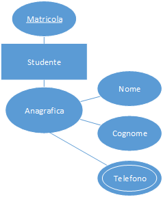

 

<!----------------- COLUMN 3 -------------------------->

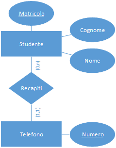 

<!------------------- END SLIDE 005 it -------------------------->

<!----------------- BEGIN SLIDE 006 it -------------------------->

### 3.2. Identificazione degli attributi derivabili

<!----------------- COLUMN 1 -------------------------->

> 006

Alcune informazioni inizialmente inserite nel diagramma per chiarezza potrebbero essere derivabili, cioè calcolabili, sulla base di altre informazioni presenti nello stesso diagramma.

Tali ridondanze non sono però sempre un male: conservandole, si aumenta la dimensione del database e si complicano le operazioni di aggiornamento, tuttavia è possibile che alcune interrogazioni ne risultino accelerate, quindi in questi casi la loro presenza è tollerabile (ma andrà opportunamente gestita).
Proprio per questo in questa fase è anche possibile, in base alle interrogazioni da effettuare sulla base di dati, decidere di introdurre nuove ridondanze. 

<!------------------- END SLIDE 006 it -------------------------->

<!----------------- BEGIN SLIDE 007 it -------------------------->

<!----------------- COLUMN 1 -------------------------->

> 007

Il numero di studenti esaminati è una statistica interessante per un corso, quindi se richiesta la inseriremmo come attributo dell'entità corso.

Tuttavia, è chiaro che questo valore può essere calcolato percorrendo la relazione `Relativo` e contando le istanze di `Esame` in relazione a un dato corso.

La decisione va presa in base al numero di volte in cui l'attributo derivato sarà consultato.

 

<!----------------- COLUMN 2 -------------------------->

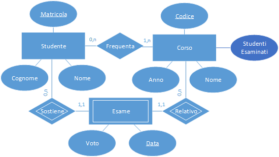 

<!------------------- END SLIDE 007 it -------------------------->

<!----------------- BEGIN SLIDE 008 it -------------------------->

### 3.3. Eliminazione delle gerarchie

<!----------------- COLUMN 1 -------------------------->

> 008

Le gerarchie, introdotte per rendere più leggibile il diagramma, devono scomparire in questa fase. Ci sono tre possibilità per eliminarle

- Fusione genitore-figli

- Fusione figli-genitore

- Trasformazione della generalizzazione in relazioni

Sono possibili anche strategie miste: la discriminante, anche qui, è il tipo di accesso che si farà sulle entità coinvolte, oltre al tipo di generalizzazione (parziale o totale). 

<!------------------- END SLIDE 008 it -------------------------->

<!----------------- BEGIN SLIDE 009 it -------------------------->

####  Fusione genitore-figli

<!----------------- COLUMN 1 -------------------------->

> 009

Gli attributi dell'entità base della generalizzazione vengono **fusi con quelli di ciascuna entità figlia**.

Le relazioni connesse all'entità base vengono **sdoppiate e connesse con ciascuna entità figlia**.

L'entità padre viene **rimossa dallo schema**.

Soluzione utile nel caso un cui, nella maggior parte dei casi, **si lavora sulle due sotto-entità in maniera separata** (nell'esempio si lavora sugli studenti o i dipendenti, ma raramente li si considera assieme).
**Non utilizzabile in caso di generalizzazione parziale!**

 

<!----------------- COLUMN 2 -------------------------->

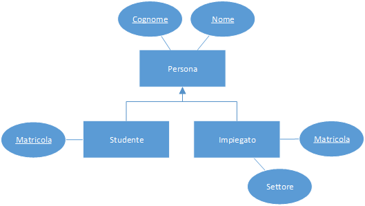

 

<!----------------- COLUMN 3 -------------------------->

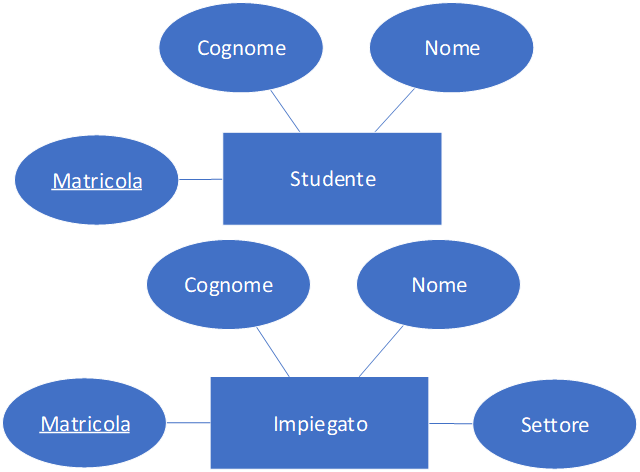 

<!------------------- END SLIDE 009 it -------------------------->

<!----------------- BEGIN SLIDE 010 it -------------------------->

####  Fusione figli-genitore

<!----------------- COLUMN 1 -------------------------->

> 010

Gli attributi delle entità figlie vengono uniti e **fusi con quelli dell'entità base**.

Le relazioni connesse alle entità figlie vengono **connesse tutte con l'entità padre**.

Le entità figlie vengono **rimosse dallo schema**.

Si introduce un **attributo discriminante** sull'entità padre (`tipo` nell'esempio).

Soluzione utile nel caso un cui, nella maggior parte dei casi, **si lavora sull'entità base e la distinzione tra le sotto-entità è di secondaria importanza**.
Va considerato anche che in ogni istanza dell'entità fusa alcuni attributi saranno sempre vuoti (quelli associati all'altro "tipo").
Adatta anche al caso di generalizzazioni parziali.

 

<!----------------- COLUMN 2 -------------------------->

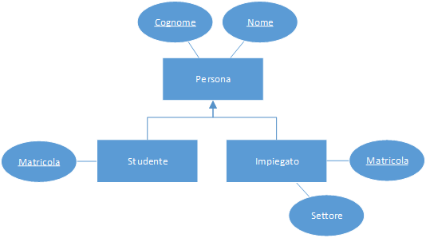

 

<!----------------- COLUMN 3 -------------------------->

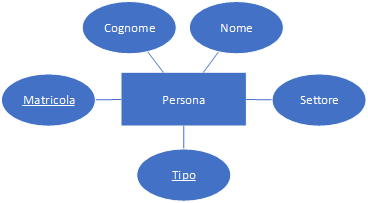 

<!------------------- END SLIDE 010 it -------------------------->

<!----------------- BEGIN SLIDE 011 it -------------------------->

####  Introduzione di relazioni

<!----------------- COLUMN 1 -------------------------->

> 011

**Si sostituisce la generalizzazione con una serie di relazioni** (con vincoli di cardinalità particolari) che connettono l'entità base alle figlie.

Soluzione utile nel caso un cui si desideri **mantenere distinte le tre entità**, senza sovraccaricare le figlie con gli attributi della base (come nel caso della fusione genitore-figli).
Adatta anche al caso di generalizzazioni parziali.   

 

<!----------------- COLUMN 2 -------------------------->

 

<!----------------- COLUMN 3 -------------------------->

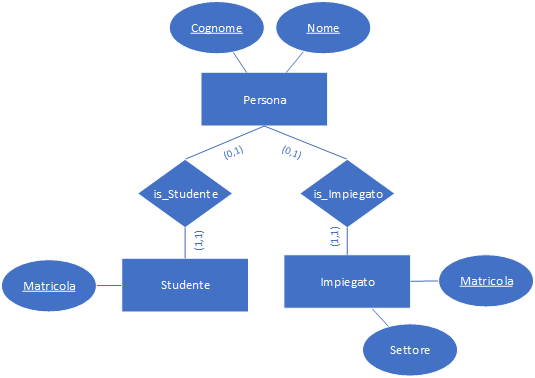 

<!------------------- END SLIDE 011 it -------------------------->

<!----------------- BEGIN SLIDE 012 it -------------------------->

####  Tecnica mista

<!----------------- COLUMN 1 -------------------------->

> 012

 

<!----------------- COLUMN 2 -------------------------->

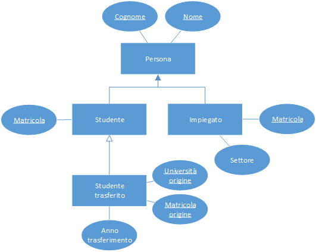

 

<!----------------- COLUMN 3 -------------------------->

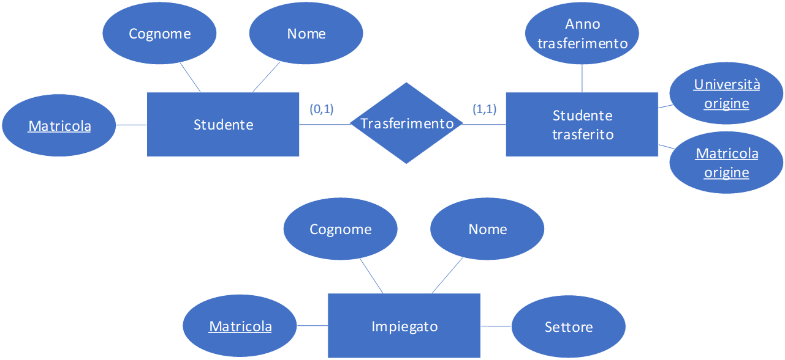 

<!------------------- END SLIDE 012 it -------------------------->

<!----------------- BEGIN SLIDE 013 it -------------------------->

### 3.4. Fusioni e decomposizioni

<!----------------- COLUMN 1 -------------------------->

> 013

A volte può accadere che, ragionando sul carico di una entità (in termini di informazioni che contiene) e sul modo in cui verrà usata, l'entità risulti troppo "carica" o, al contrario inutile da sola.
In questi casi è possibile fondere o frammentare un'entità, rimuovendo delle relazioni o introducendone di nuove.
*L'eliminazione degli attributi multi valore, già vista, viene fatta rientrare spesso anche in questa attività.*

L'obiettivo è, come sempre, quello di minimizzare il carico della base di dati durante l'uso, separando le entità in parti che vengono solitamente usate in maniera distinta o raggruppando le entità che vengono sempre usate assieme.

Lo stesso discorso può valere per relazioni con semantica troppo "ampia" che possono essere suddivise in più relazioni particolari. 

<!------------------- END SLIDE 013 it -------------------------->

<!----------------- BEGIN SLIDE 014 it -------------------------->

####  Decomposizione di Entità

<!----------------- COLUMN 1 -------------------------->

> 014

`Corso` è un'entità troppo carica di informazioni.

Ragionando sul modo in cui queste informazioni vengono utilizzate, **le si possono suddividere in tre gruppi**, che sono usati in maniera progressiva:

- Informazioni di base

- Informazioni sulla didattica

- Libri di testo

In base a questa considerazione, l'entità viene partizionata come illustrato qui di fianco.

 

<!----------------- COLUMN 2 -------------------------->

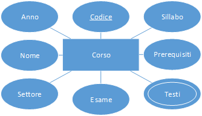

 

<!----------------- COLUMN 3 -------------------------->

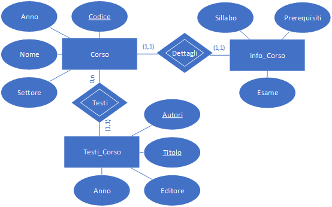 

<!------------------- END SLIDE 014 it -------------------------->

<!----------------- BEGIN SLIDE 015 it -------------------------->

####  Decomposizione di Relazioni

<!----------------- COLUMN 1 -------------------------->

> 015

La relazione `Titolare` memorizza sia le titolarità correnti del corso sia quelle passate (necessarie a fini amministrativi).
Tuttavia, **è molto comune lavorare sulle titolarità correnti, mentre quelle passate vengono usate solo in casi particolari**.

In base a queste considerazioni, la relazione viene suddivisa in due relazioni come illustrato qui di fianco.

 

<!----------------- COLUMN 2 -------------------------->

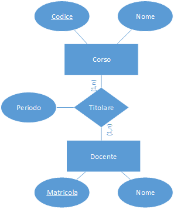

 

<!----------------- COLUMN 3 -------------------------->

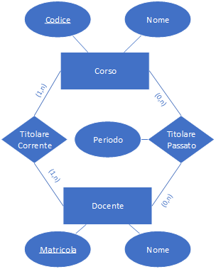 

<!------------------- END SLIDE 015 it -------------------------->

<!----------------- BEGIN SLIDE 016 it -------------------------->

## 4. Traduzione nel Modello Relazionale (logico)

<!----------------- COLUMN 1 -------------------------->

> 016

Il modello ER ristrutturato è ora pronto per la traduzione del modello relazionale.

Gli elementi rimasti nel diagramma ER, cioè entità, relazioni e attributi, andranno mappati sulle tabelle e colonne del modello logico relazionale.

I vincoli di cardinalità e le chiavi verranno in parte incorporate nel modello relazionale, e in parte potranno essere implementate solo a livello fisico, cioè sul DBMS.

I tipi di dato, finora annotati sul diagramma ER, saranno annotati anche nello schema relazionale. 

<!------------------- END SLIDE 016 it -------------------------->

<!----------------- BEGIN SLIDE 017 it -------------------------->

### 4.1. Entità e Attributi

<!----------------- COLUMN 1 -------------------------->

> 017

Le **entità** si mappano facilmente nel modello relazionale sotto forma di **tabelle**. 

Gli **attributi** delle entità saranno le **colonne** delle tabelle.

In generale, la **chiave primaria** di un'entità sarà anche la chiave primaria della corrispondente tabella relazionale.
Tuttavia, a questo punto è opportuno **ottimizzare le chiavi** tenendo conto che una buona chiave:

- Non deve essere complessa (comprendere troppe colonne),

- Dovrebbe essere basata su tipi di dato semplici.

Queste condizioni servono a mantenere bassa **la complessità e la dimensione degli indici** che il DBMS costruirà sulle chiavi, velocizzandone l'aggiornamento e la consultazione, nonché rendere la chiave **più facile da manipolare** via codice.
Nella pratica, quasi sempre si introduce **una nuova chiave** per ogni entità, costituita da **un numero intero incrementale**, facile da gestire per il DBMS e per l'utente.
In questo caso, la chiave precedentemente specificata nel modello ER potrà essere trasformata in un vincolo UNIQUE (chiave non primaria) nel database, se se ne vuole preservare la semantica. 

<!------------------- END SLIDE 017 it -------------------------->

<!----------------- BEGIN SLIDE 018 it -------------------------->

####  Esempio

<!----------------- COLUMN 1 -------------------------->

> 018

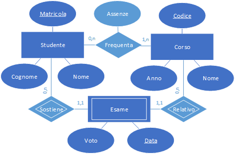

 

<!----------------- COLUMN 2 -------------------------->

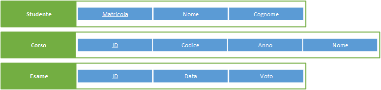 

<!------------------- END SLIDE 018 it -------------------------->

<!----------------- BEGIN SLIDE 019 it -------------------------->

### 4.2. Relazioni

<!----------------- COLUMN 1 -------------------------->

> 019

La regola generale in questo caso è quella di **creare una tabella relazionale per ogni relazione** nel modello ER.
La relazione **conterrà le chiavi delle entità che connette** che ne costituiranno a loro volta la chiave primaria.
In questo modo la tabella conterrà le coppie di chiavi primarie delle istanze di entità messe in corrispondenza, realizzando il concetto di relazione.
A volte, anche qui ha senso introdurre una nuova chiave primaria intera, ma è anche possibile usare la coppia di chiavi delle entità connesse, che sarà molto probabilmente costituita da una coppia di interi.

Eventuali **attributi** sulla relazione diventano naturalmente **colonne** della tabella corrispondente.

La corrispondenza tra le chiavi delle tabelle-entità e quelle delle tabelle-relazioni viene spesso visualizzata con delle frecce tracciate tra le colonne delle tabelle relazionali. 

<!------------------- END SLIDE 019 it -------------------------->

<!----------------- BEGIN SLIDE 020 it -------------------------->

####  Esempio

<!----------------- COLUMN 1 -------------------------->

> 020

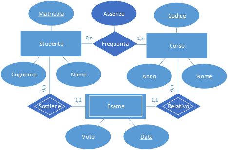

 

<!----------------- COLUMN 2 -------------------------->

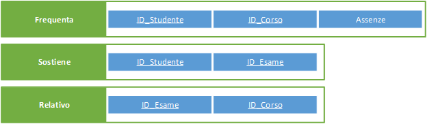 

<!------------------- END SLIDE 020 it -------------------------->

<!----------------- BEGIN SLIDE 021 it -------------------------->

<!----------------- COLUMN 1 -------------------------->

> 021

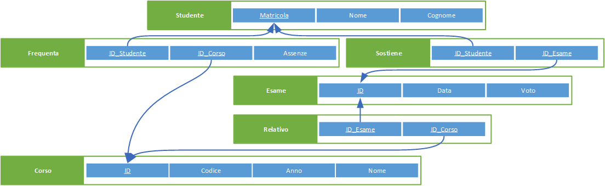 

<!------------------- END SLIDE 021 it -------------------------->

<!----------------- BEGIN SLIDE 022 it -------------------------->

### 4.3. Vincoli di Cardinalità

<!----------------- COLUMN 1 -------------------------->

> 022

Tuttavia, la regola appena vista crea spesso modelli relazionali con tabelle inutili, e può essere ottimizzata osservando che se una relazione ha un vincolo massimo 1 su uno dei suoi lati (quindi `(0,1)` o `(1,1)`), questo significa che da quel lato l'entità sarà messa in corrispondenza con una o nessuna entità, ma non più di una. 

In questo caso si "fonde" la relazione con l'entità dal lato "1", migrando su di essa gli eventuali attributi della relazione e la chiave dell'altra entità. Si può verificare come questa trasformazione preservi ancora tutta l'informazione contenuta nella relazione originaria.

Se questa situazione si verifica su entrambe le estremità della relazione, è possibile fondere la relazione e le due entità in una sola entità (che però potrebbe essere troppo "carica"), oppure scegliere di effettuare la fusione tra la relazione e una sola delle due entità (sempre basandosi sul tipo di accesso atteso ai dati). 

<!------------------- END SLIDE 022 it -------------------------->

<!----------------- BEGIN SLIDE 023 it -------------------------->

####  Entità Deboli

<!----------------- COLUMN 1 -------------------------->

> 023

Le entità deboli, come abbiamo visto, utilizzano una o più delle loro relazioni come parte della propria chiave.
In questo caso, il vincolo di cardinalità su quel lato della relazione deve essere sempre `(1,1)` (l'entità ha bisogno di una relazione per essere identificata).

Questo implica, in base alle regole appena viste, che la tabella corrispondente all'entità incorporerà anche la chiave dell'altra entità in relazione con essa, contribuendo come ci si aspettava a formarne la chiave. 

<!------------------- END SLIDE 023 it -------------------------->

<!----------------- BEGIN SLIDE 024 it -------------------------->

####  Esempio

<!----------------- COLUMN 1 -------------------------->

> 024

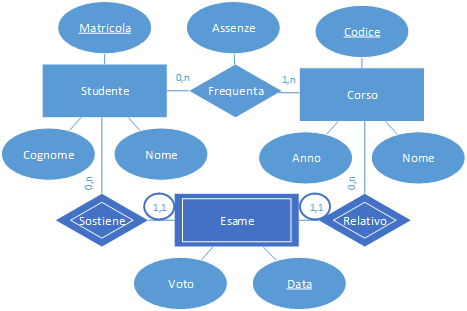

 

<!----------------- COLUMN 2 -------------------------->

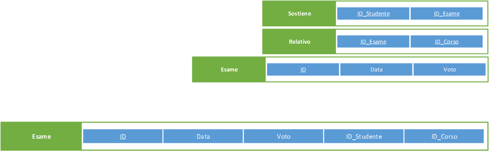 

<!------------------- END SLIDE 024 it -------------------------->

<!----------------- BEGIN SLIDE 025 it -------------------------->

### 4.4. Esempio completo

<!----------------- COLUMN 1 -------------------------->

> 025

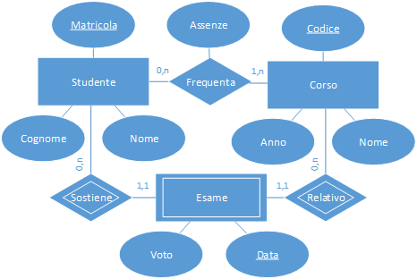

 

<!----------------- COLUMN 2 -------------------------->

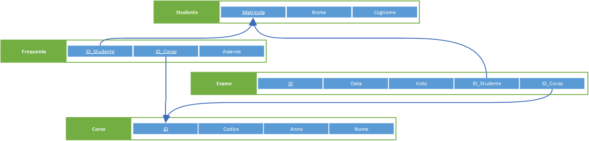 

<!------------------- END SLIDE 025 it -------------------------->
