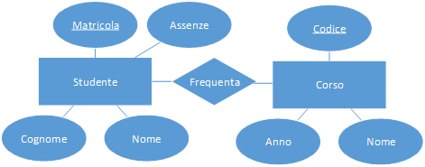

<!----------------- BEGIN SLIDE 001 it -------------------------->

#  Progettazione Concettuale - Il Modello Entità - Relazione

<!----------------- COLUMN 1 -------------------------->

> 001

Giuseppe Della Penna

Università degli Studi di L'Aquila    
giuseppe.dellapenna@univaq.it    
http://people.disim.univaq.it/dellapenna

> *Questo documento si basa sulle slide del corso di Laboratorio di Basi di Dati, riorganizzate per una migliore l'esperienza di lettura. Non è un libro di testo completo o un manuale tecnico, e deve essere utilizzato insieme a tutti gli altri materiali didattici del corso. Si prega di segnalare eventuali errori o omissioni all'autore.*

> Quest'opera è rilasciata con licenza CC BY-NC-SA 4.0. Per visualizzare una copia di questa licenza, visitate il sito https://creativecommons.org/licenses/by-nc-sa/4.0

<!----------------- BEGIN TOC -------------------------->

 - [1. Le Fasi di Progettazione di un Database](#1-le-fasi-di-progettazione-di-un-database)

 - [2. Progettazione Concettuale](#2-progettazione-concettuale)

 - [3. I Diagrammi Entità-Relazione](#3-i-diagrammi-entità-relazione)

    - [3.1. Entità](#31-entità)

    - [3.2. Attributi](#32-attributi)

    - [3.3. Chiavi](#33-chiavi)

    - [3.4. Generalizzazioni](#34-generalizzazioni)

    - [3.5. Relazioni](#35-relazioni)

    - [3.6. Entità Deboli](#36-entità-deboli)

<!------------------- END TOC --------------------------> 

<!------------------- END SLIDE 001 it -------------------------->

<!----------------- BEGIN SLIDE 002 it -------------------------->

## 1. Le Fasi di Progettazione di un Database

<!----------------- COLUMN 1 -------------------------->

> 002

La progettazione di un database passa per tre fasi a cascata:

- Concettuale

- Logica

- Fisica

A monte della progettazione concettuale c'è la raccolta e l'analisi dei requisiti, mentre a valle di quella fisica c'è un DBMS che implementa tutti i requisiti raccolti all'inizio. 

<!------------------- END SLIDE 002 it -------------------------->

<!----------------- BEGIN SLIDE 003 it -------------------------->

## 2. Progettazione Concettuale

<!----------------- COLUMN 1 -------------------------->

> 003

Nella progettazione concettuale si cerca di creare un *modello del dominio da rappresentare* nel database che ne *catturi tutti gli elementi più importanti in maniera chiara*.

Condizione importante di questa fase è il rimanere il più possibile aderenti alla realtà, in modo da poter verificare facilmente se il modello è corretto rispetto al dominio, anche discutendone col committente.
In altre parole, il modello *non deve in alcun modo essere influenzato da scelte tecniche relative al DBMS* che verrà utilizzato (se noto a priori) e al suo modello di memorizzazione dei dati.

Si usano a questo scopo preferibilmente modelli grafici, più semplici da visualizzare. 

<!------------------- END SLIDE 003 it -------------------------->

<!----------------- BEGIN SLIDE 004 it -------------------------->

## 3. I Diagrammi Entità-Relazione

<!----------------- COLUMN 1 -------------------------->

> 004

I diagrammi Entità-Relazione (*ER*) sono uno degli strumenti più utilizzati per la progettazione concettuale di una base di dati.
Si tratta di un formalismo grafico che permette di rappresentare gli *elementi* facenti parte del dominio che si vuole modellare nel database e le loro *interconnessioni*.

Naturalmente ER non è l'unico formalismo disponibile a questo scopo: ad esempio, molti preferiscono usare i *class diagram* di UML a questo scopo.
Inoltre, esistono varie sintassi per gli stessi diagrammi ER: noi ci focalizzeremo sulla sintassi "classica", ma vedremo negli esempi anche sintassi alternative utili per semplificare alcuni aspetti dei diagrammi. 

<!------------------- END SLIDE 004 it -------------------------->

<!----------------- BEGIN SLIDE 005 it -------------------------->

<!----------------- COLUMN 1 -------------------------->

> 005

I diagrammi ER definiscono i seguenti elementi

- Entità

- Attributi

- Relazioni

Eventuali dettagli del dominio non esprimibili con questi elementi devo essere annotati a margine del diagramma, per poter essere poi incorporati nelle successive fasi di modellazione. 

<!------------------- END SLIDE 005 it -------------------------->

<!----------------- BEGIN SLIDE 006 it -------------------------->

### 3.1. Entità

<!----------------- COLUMN 1 -------------------------->

> 006

Ogni entità rappresenta una **classe di oggetti nel dominio** dell'applicazione.
Ad esempio, l'entità *studente* conterrà tante istanze quanti sono gli studenti da rappresentare nella base di dati.

Le entità sono sempre *oggetti autonomi*, non facenti parte (aggregati) ad altri elementi.

Le entità si rappresentano come rettangoli con bordo continuo contenenti il nome dell'entità stessa, generalmente un sostantivo.

 

<!----------------- COLUMN 2 -------------------------->

{.width25}

> Un'entità rappresenta una classe di oggetti distinti ed autonomi all'interno del dominio da rappresentare

{.width25}

> Il nome (dello studente) non è un'entità, perché è parte dello studente e non ha senso da solo 

<!------------------- END SLIDE 006 it -------------------------->

<!----------------- BEGIN SLIDE 007 it -------------------------->

### 3.2. Attributi

<!----------------- COLUMN 1 -------------------------->

> 007

Ogni entità può avere un numero arbitrario di attributi che **ne definiscono il contenuto informativo**.
Ogni istanza di entità avrà, in generale, un insieme di valori differenti per i suoi attributi.

Gli attributi possono essere anche

- composti, cioè composti da sotto-attributi,

- multi valore, cioè contenere più di un valore.

Gli attributi si legano all'entità di appartenenza tramite il simbolo grafico illustrato. 

 

<!----------------- COLUMN 2 -------------------------->

{.width75}

> Un attributo rappresenta una proprietà di un'entità, ovvero un valore che caratterizza l'entità

 

<!----------------- COLUMN 3 -------------------------->

{.width75}

> Gli attributi composti sono spesso usati per raggruppare attributi correlati. Un attributo può anche ammettere più valori (più numeri di telefono per uno studente, nell'esempio) 

<!------------------- END SLIDE 007 it -------------------------->

<!----------------- BEGIN SLIDE 008 it -------------------------->

### 3.3. Chiavi

<!----------------- COLUMN 1 -------------------------->

> 008

Per **distinguere tra loro le istanze** di un'entità (ad es., distinguere gli studenti), è necessario definire un attributo particolare, o un insieme di attributi, che siano diversi in ogni istanza.
L'attributo o gli attributi così individuati costituiranno la **chiave primaria** dell'entità.

Ogni entità deve avere la sua chiave primaria. Tuttavia, alcune entità potrebbero non contenere attributi sufficienti per costituire una chiave (*entità deboli*).

Gli attributi chiave si indicano graficamente sottolineandone il nome.

 

<!----------------- COLUMN 2 -------------------------->

{.width75}

{.width75}

 

<!----------------- COLUMN 3 -------------------------->

{.width75}

> L'attributo chiave deve avere un valore diverso in tutte le istanze dell'entità! 

<!------------------- END SLIDE 008 it -------------------------->

<!----------------- BEGIN SLIDE 009 it -------------------------->

### 3.4. Generalizzazioni

<!----------------- COLUMN 1 -------------------------->

> 009

A volte può essere utile decomporre concettualmente un'entità in una gerarchia di entità con diverso livello di dettaglio. Questo permette di caratterizzare meglio i singoli componenti della gerarchia.   
Si parla in questo caso di **gerarchia di generalizzazione** tra le entità. La generalizzazione può essere  **parziale** o **totale**.

Le generalizzazioni sono un'estensione dei diagrammi ER standard, sebbene molto diffusa, e si rappresenta graficamente usando una notazione presa in prestito da UML. 

<!------------------- END SLIDE 009 it -------------------------->

<!----------------- BEGIN SLIDE 010 it -------------------------->

<!----------------- COLUMN 1 -------------------------->

> 010

Supponiamo di avere nel nostro DB i dati relativi a tutti gli studenti e gli impiegati dell'Università.
Studenti e impiegati avranno attributi differenti, ma anche un gruppo di attributi comuni, ad esempio quelli anagrafici.

Qual è il modo migliore di rappresentare queste due entità?

 

<!----------------- COLUMN 2 -------------------------->

> Questa soluzione duplica gli attributi comuni a impiegato e studente. Graficamente, aumenta la complessità del diagramma.

 

<!----------------- COLUMN 3 -------------------------->

> Qui abbiamo astratto il concetto generale di persona ed abbiamo assegnato a essa tutti gli attributi di impiegato e studente. Ma è corretto? 

<!------------------- END SLIDE 010 it -------------------------->

<!----------------- BEGIN SLIDE 011 it -------------------------->

####  Totali

<!----------------- COLUMN 1 -------------------------->

> 011

Partendo dall'esempio precedente, l'uso della generalizzazione permette di rendere più leggibile il diagramma e mostra con chiarezza il rapporto esistente tra le entità persona, impiegato e studente.

Poiché per noi le persone sono solo impiegati o studenti, la generalizzazione si dice *totale* (freccia *piena*).

 

<!----------------- COLUMN 2 -------------------------->

{.width75}

> I due numeri di matricola hanno semantica diversa, quindi è pericoloso "fonderli" in persona.

> Persona ha la sua chiave, come pure le sue sotto-entità. Notare che la coppia (nome,cognome) potrebbe non essere una chiave univoca. 

<!------------------- END SLIDE 011 it -------------------------->

<!----------------- BEGIN SLIDE 012 it -------------------------->

####  Parziali

<!----------------- COLUMN 1 -------------------------->

> 012

In questo caso, invece, la generalizzazione è *parziale* (freccia *vuota*): uno studente *può essere* uno studente trasferito da altra Università. In altre parole, le istanze di studente non devono necessariamente appartenere anche a una delle entità più "dettagliate" (qui ne abbiamo una sola).

 

<!----------------- COLUMN 2 -------------------------->

{.width50} 

<!------------------- END SLIDE 012 it -------------------------->

<!----------------- BEGIN SLIDE 013 it -------------------------->

####  Su più livelli

<!----------------- COLUMN 1 -------------------------->

> 013

Ovviamente le generalizzazioni possono anche comporsi tra loro...

 

<!----------------- COLUMN 2 -------------------------->

 

<!------------------- END SLIDE 013 it -------------------------->

<!----------------- BEGIN SLIDE 014 it -------------------------->

### 3.5. Relazioni

<!----------------- COLUMN 1 -------------------------->

> 014

Finora abbiamo mappato sul diagramma ER:

- gli oggetti (entità) del nostro dominio

- i dati (attributi) che li caratterizzano

Tuttavia, un altro aspetto importante da esprimere è il modo in cui questi oggetti sono in relazione tra loro.
Ad esempio, se rappresentiamo le entità *studente* e *corso*, vorremmo poter esprimere il fatto che gli studenti frequentano i corsi. 

<!------------------- END SLIDE 014 it -------------------------->

<!----------------- BEGIN SLIDE 015 it -------------------------->

<!----------------- COLUMN 1 -------------------------->

> 015

Le relazioni tra entità si rappresentano graficamente con un rombo (la relazione vera e propria) che connette le due entità correlate.
Il nome della relazione è solitamente un verbo, ma in alcuni casi può essere anche un sostantivo.

La relazione qui rappresentata è *binaria*, ed è la più comune.

 

<!----------------- COLUMN 2 -------------------------->

{.width75}

> ...gli studenti frequentano i corsi...

{.width75} 

<!------------------- END SLIDE 015 it -------------------------->

<!----------------- BEGIN SLIDE 016 it -------------------------->

####  Ternarie (e non binarie)

<!----------------- COLUMN 1 -------------------------->

> 016

{.width75}

> Questa relazione ternaria ("lo studente frequenta un corso per cui sostiene un esame") è corretta, ma difficile da interpretare

 

<!----------------- COLUMN 2 -------------------------->

{.width75}

> "Esplodendo" la relazione ternaria, si ottiene un diagramma molto più leggibile 

<!------------------- END SLIDE 016 it -------------------------->

<!----------------- BEGIN SLIDE 017 it -------------------------->

####  Attributi

<!----------------- COLUMN 1 -------------------------->

> 017

Una relazione può avere anche degli attributi, indicati graficamente con lo stesso simbolo usato per gli attributi delle entità.     

Il significato di un attributo su una relazione è quello di una caratteristica che non riguarda le entità coinvolte, ma il fatto stesso di essere in relazione tra loro. 

Ad esempio: come inseriamo nel nostro schema relazionale studenti-corsi il numero di assenze a lezione? 

<!------------------- END SLIDE 017 it -------------------------->

<!----------------- BEGIN SLIDE 018 it -------------------------->

<!----------------- COLUMN 1 -------------------------->

> 018

{.width75}

> Se inseriamo le assenze sullo studente, queste varranno per tutti corsi che frequenta!

{.width75}

> Se inseriamo le assenze sul corso, queste varranno per tutti gli studenti che lo frequentano!

 

<!----------------- COLUMN 2 -------------------------->

{.width75}

> Così le assenze sono quelle di uno studente per un certo corso. 

<!------------------- END SLIDE 018 it -------------------------->

<!----------------- BEGIN SLIDE 019 it -------------------------->

####  Cardinalità

<!----------------- COLUMN 1 -------------------------->

> 019

Le relazioni hanno sempre dei *vincoli di cardinalità sulla partecipazione delle entità*, che indicano in che numero le entità coinvolte possono parteciparvi.   

Il vincolo di cardinalità, nella sua forma più generale, è espresso come una coppia (*min*, *max*) posta sulla linea che unisce la relazione all'entità.   
Come cardinalità massima è possibile indicare l'infinito, rappresentato spesso con la lettera "n".  

Esempi tipici di cardinalità sono `(1,1)` (*esattamente uno*), `(1,n)` (*almeno uno*), `(0,1)` ("*opzionalmente*"), `(0,n)` (*un numero qualsiasi*).

Spesso troviamo usati anche dei più semplici *rapporti di cardinalità* con la sintassi `1:1` (*uno a uno*), `1:n` (*uno a molti*) o `m:n` (*molti a molti*): in questi casi, ciascun numero rappresenta il vincolo di partecipazione massimo per un lato della relazione, mentre quello minimo è implicitamente sempre 1. 
Questa notazione è leggermente meno informativa rispetto a quella dei vincoli, quindi preferiremo sempre la prima nei nostri esempi. 

<!------------------- END SLIDE 019 it -------------------------->

<!----------------- BEGIN SLIDE 020 it -------------------------->

<!----------------- COLUMN 1 -------------------------->

> 020

{.width75}

> Uno studente può frequentare un numero qualsiasi di corsi e sostenere un numero qualsiasi di esami; un corso è frequentato da almeno uno studente ed ha associati un numero qualsiasi di esami. Un esame è relativo ad esattamente un corso ed è sostenuto da esattamente uno studente

 

<!----------------- COLUMN 2 -------------------------->

{.width75}

> Questa versione, con rapporti di cardinalità, esprime sostanzialmente le stesse informazioni, ma con una precisione minore. 

<!------------------- END SLIDE 020 it -------------------------->

<!----------------- BEGIN SLIDE 021 it -------------------------->

### 3.6. Entità Deboli

<!----------------- COLUMN 1 -------------------------->

> 021

Un'entità debole non ha attributi sufficienti a formare una chiave, ma *è identificata dal fatto di essere in relazione con altre entità*, quindi deve includere nella chiave una o più delle sue relazioni. 

Nell'esempio, un esame è univocamente specificato dall'insieme della sua data, del corso di appartenenza e dello studente che lo ha sostenuto.

Per includere una relazione nella chiave, la sua cardinalità deve essere `(1,1)`.

 

<!----------------- COLUMN 2 -------------------------->

{.width75} 

<!------------------- END SLIDE 021 it -------------------------->
